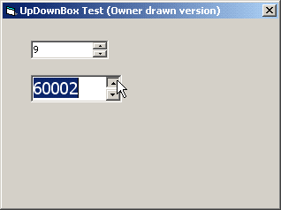



## ucUpDownBox

### Description

A simple Up-Down Box. Two versions: scrollbar based and owner drawn. Long support / key support.
 
### More Info
 

             |
---                |---
**Submitted On**   |2003-12-10 12:00:48
**By**             |[Carles P\.V\.](https://github.com/Planet-Source-Code/PSCIndex/blob/master/ByAuthor/carles-p-v.md)
**Level**          |Beginner
**User Rating**    |4.9 (34 globes from 7 users)
**Compatibility**  |VB 6\.0
**Category**       |[Custom Controls/ Forms/  Menus](https://github.com/Planet-Source-Code/PSCIndex/blob/master/ByCategory/custom-controls-forms-menus__1-4.md)
**World**          |[Visual Basic](https://github.com/Planet-Source-Code/PSCIndex/blob/master/ByWorld/visual-basic.md)
**Archive File**   |[ucUpDownBo16827612112003\.zip](https://github.com/Planet-Source-Code/carles-p-v-ucupdownbox__1-50379/archive/master.zip)

